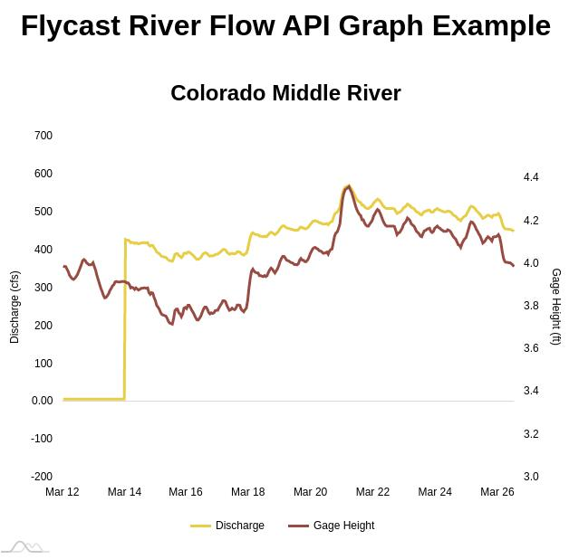

# FlyCast River Flows API Graph Example

This is an example demonstrating how to display data from the [FlyCast River Flows API](https://api.flycastusa.com) using the Javascript [amCharts](https://www.amcharts.com/) library.

## Running the example

1. Clone this repository
2. Using your editor of choice, change `flow-graph.js:4` to use your FlyCast provided API key

    ```javascript
    var flycastFlowConfig = {
        apiKey: "YOUR_API_KEY_HERE",
        ...
    };
    ```

3. Start a local HTTP server so these files can be viewed in a web browser. One of the easiest ways to do this is to use the Python built-in HTTP server

    1. In a new terminal use the `cd` command to navigate to the directory where you cloned this repository
    2. Assuming you have Python installed, run the command below. Instructions for installing Python and additional details are available [here](https://developer.mozilla.org/en-US/docs/Learn/Common_questions/set_up_a_local_testing_server)

    ```bash
    # If Python version is 3.X
    python3 -m http.server
    # On windows try "python" instead of "python3", or "py -3"
    # If Python version is 2.X
    python -m SimpleHTTPServer
    ```

4. Open http://localhost:8000 in your web browser to see the example. If everything is working correctly, it should look like the screenshot below
   

## Installing into your web page

1. Include the Javascript files

    ```html
    <script src="https://www.amcharts.com/lib/4/core.js"></script>
    <script src="https://www.amcharts.com/lib/4/charts.js"></script>
    <script src="https://www.amcharts.com/lib/4/themes/animated.js"></script>
    <script src="flow-graph.js"></script>
    ```

2. Create the elements to display the graph and title.

    - These elements need to have a unique ID. Configure the IDs in `flow-graph.js` lines 5-6.
    - Set the `data-river-code` attribute to the FlyCast code for the river you wish to display.

    ```html
    <h2 id="chart-title"></h2>
    <div id="chart-container" data-river-code="COLOMDRV"></div>
    ```

    ```javascript
    var flycastFlowConfig = {
        ...
        chartElementId: "chart-container",
        chartTitleId: "chart-title",
        ...
    };

    ```

3. Edit `flow-graph.js:4` to use your FlyCast provided APIKey

    ```javascript
    var flycastFlowConfig = {
        apiKey: "YOUR_API_KEY_HERE",
        ...
    };
    ```
